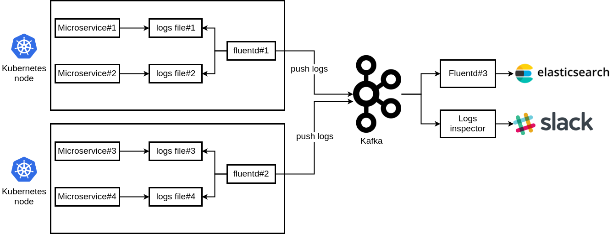

# terraform-k8s-logging 

Terraform module to provide streaming of microservices logs to Kafka. 
Inspired by [Jakub Bujny](https://jakubbujny.com/2018/07/02/stream-microservices-logs-from-kubernetes-to-kafka/).

---

Fluentd DaemonSet is used to ship logs to Kafka. More info can be found [here](https://docs.fluentd.org/container-deployment/kubernetes).


> (2018). Retrieved from https://jakubbujny.files.wordpress.com/2018/07/fluend-kafka-kubernetes.png

## Usage

```hcl
module "terraform-k8s-logging " {
  source = "git::ssh://git@github.com:gaarm/terraform-k8s-logging.git?ref=tags/1.0.0"
}
```
## Inputs

| Name | Description | Type | Default | Required |
|------|-------------|:----:|:-----:|:-----:|
| logging_kafka_broker_list | Kafka broker list used for logging | string | n/a | yes |
| logging_kafka_topic | Kafka topic used for logging | string | n/a | yes |


## Outputs

None